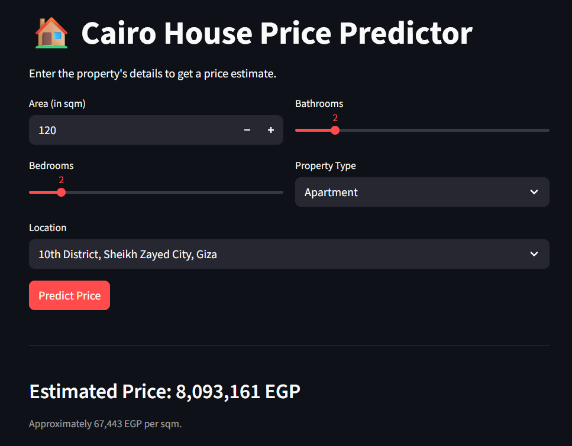

# Cairo House Price Predictor

[](https://huggingface.co/spaces/yyouretoast/cairo-house-pricer)
[](https://www.python.org/)
[](https://www.docker.com/)

End-to-end ML pipeline that estimates real estate prices in Cairo, Egypt.

**Live Demo: (https://huggingface.co/spaces/yyouretoast/cairo-house-pricer)**

## Overview
This project solves the problem of vague real estate pricing in Cairo. By analyzing thousands of listings, the model estimates market value based on area, location, and finishing type.

## Stack
- **Core:** Python 3
- **ML:** Scikit-Learn
- **Data Processing:** Pandas, NumPy
- **Deployment:** Streamlit, Docker, HuggingFace Space

## Model
- **Algorithm:** Random Forest
- **Training Data:** Egyptian property listings
- **Accuracy:** About 70% R^2 score on unseen test data

## If you'd like to run this locally:
```
git clone https://github.com/yyouretoast/cairo-house-pricer.git
cd cairo-house-pricer
pip install -r requirements.txt
streamlit run app.py
